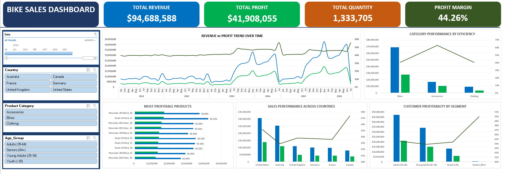

# Bike Sales & Profitability Analysis

## Executive Summary

Purpose

This project analyzes bike sales performance using transactional sales data to identify key drivers of profitability across product categories, customer segments, products, and geographic markets. But despite strong overall sales performance, the business lack clarity regarding which categories, customer segment, products and markets generate the greatest profitability and operational efficiency. Understanding these factors is necessary to support data-driven dscision making and resource allocation. This project analysis aims to tackle this problems and provide business recommendation to improve business profitability.

Findings & Conclusion

The findings reveal that Accessories deliver the highest profit margin efficiency, while Bikes generate the largest share of overall profit despite operating at lower margins. Adults and Young Adults account for the majority of profit contribution with seniors performing the highest in profit margin efficiency. while no single product dominate in profit contribution some products cocnsistently show weaker margin performance. The findings also reveal United States and Austrialia as the business most valuable market both accounting for more than half of the business sales while Canada demonstrates the strongest margin performance among all markets despite relatively low revenue volume.

With these findings, the business now has a clear directive on which product categories, customer segments, products, and regions is the greatest profit contributors and which performed best in margin efficiency. This insight helps the business in better decision making and future investment.

Recommendation

The analysis also identified potential profitability inefficiencies across several products, categories, customer segments, and regions. Based on these findings, the following actions are recommended;

- Conduct a cost structure analysis across products, customer segments, and regions to identify profitability inefficiencies.
- Investigate production and operational processes to determine factors affecting margin performance.
- Evaluate pricing strategies across categories and markets to identify opportunities for improved profitability.
- Prioritize investment in high-margin categories and products to maximize profit growth.
- Explore growth opportunities in high-efficiency markets such as Canada.

This actions are recommended to improve overall profitability and support future business growth.

## Project Overview

This project analyzes bike sales performance across products, categories, customer segment and regions. The goal of this project is to identify profitability drivers, evaluate operational efficiency, uncover inefficienies and opportunities for business growth.

## Business Questions

1. Are we growing?
2. Which category is most efficient?
3. Which products drive profitability?
4. Which country is the most valuable market?
5. Which customer segment is the most profitable?

## Dataset Information

Source: Kaggle Bike Sales Dataset

Data Type: Retail Sales Transaction data

Original Dataset
Records: 113,037
Fields: 18

Post-Cleaning Dataset
Records: 112,037
Fields: 15

Tools Used
- Microsoft Excel.
- Pivot Table.
- pivot Chart.

## Methodology

This dataset was cleaned and analyze through the following steps and with the use of the following techniques.

Data Preparation
- Removal of duplicate records.
- Validation and recalculation of revenue and profit matrics.
- Standardization of gender values.
- Standardization of columns names for consistency.
- Removal of redundant date related field.

Analytical Techniques
- Data Cleaning.
- Data Validation.
- KPI Analysis.
- Dashboard Design.

## Key Performance Indicators (KPIs)

The business generated $94,688,588 in sales and also made a profit of $41,908,055 which amounted to a margin efficiency of 44,26%.

## Dashboard Overview

This dashboard provides an interactive view of sales performance, profitability, customer segments, products and country performance.

## Key Findings

# Finding 1 – Business Growth

Insight

Hypothesis

Recommendation

# Finding 2 – Category Efficiency

Insight

Hypothesis

Recommendation

# Finding 3 – Product Profitability

Insight

Hypothesis

Recommendation

# Finding 4 – Country Analysis

Insight

Hypothesis

Recommendation

# Finding 5 - Customer Segment Profitability

Insight

Hypothesis

Recommendation

## Limitations

## Conclusion
